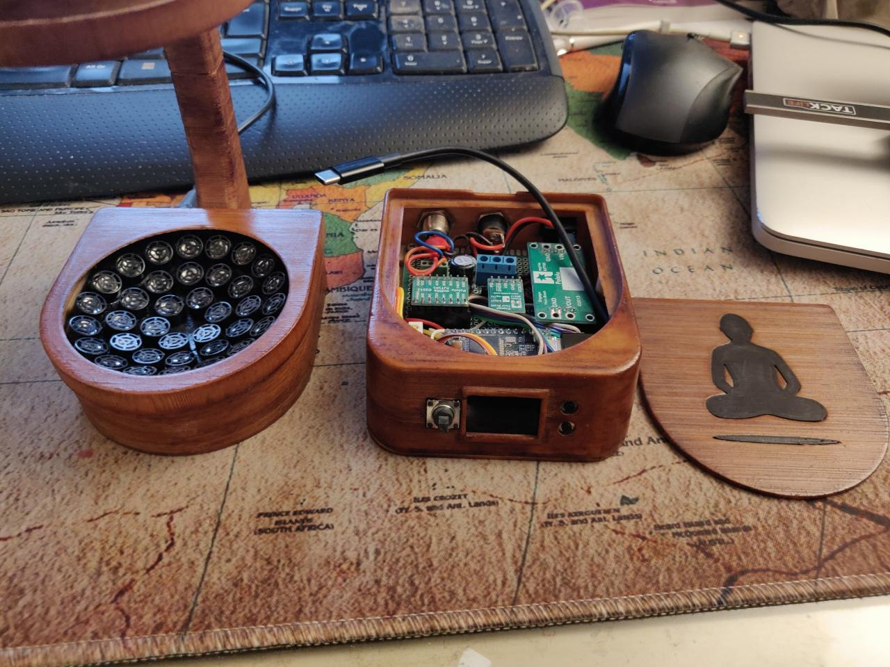

# Teensylev-V2

This repo contain the source code, STL files and schematics for a Teensy powered version of Asier Marzo's Tinylev acoustic levitator c.f. [Tinylev's Instructable](https://www.instructables.com/id/Acoustic-Levitator/)

**Build notes**

- 3D Printed in wood PLA. Stained and varnished. 

- Electronic assembly on a 90mm x 70mm perfboard (tight fit inside the control box, beware to leave some room at the front for the display). 

- Electronic components needed:  
   - 72 x Manorshi MSO-P1040-H07T transducers
   - Teensy 3.2 (mcu)
   - Pololu S18V20ALV (step up/step down, provides power to transducers) 
   - Pololu D24V10F5 (step up/step down to 5V, provides power to teensy) 
   - Pololu TB6612FNG (motor driver for driving the transducers)
   - Adafruit 3321. MiniTFT + Joystick (for control)
   - DC barrel jack (power connector)
   - 4 wires male/female connectors (for connecting the control box and the transducers arrays). 
   - misc: wires, 1/4W resistors, capacitors, 100K pot.

- Hack required to control the output voltage of S18V20ALV: a wire need to be soldered to the center leg of the mini pot. on the board. See [here](./Schematics/hack-S18V20ALV.png)

